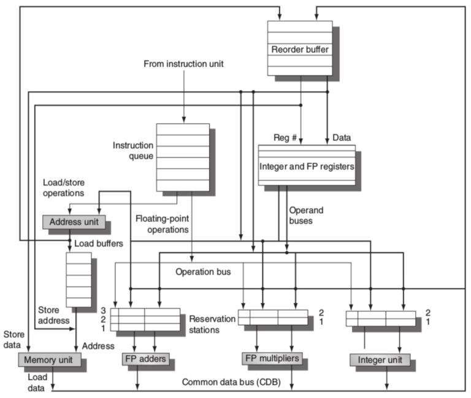

# CPU Dynamic Scheduling Simulator

### ***Using Tomasulo's Dynamic Scheduling Algorithm***


---

## Overview

This is a simulator for Tomasulo's Algorithm, a dynamic scheduling algorithm for out-of-order execution of instructions. It is used in modern CPUs to improve performance by allowing instructions to be executed in parallel.

The simulator reads a trace file of RISC-V instructions and simulates the dynamic reordering of instructions in a CPU. It uses reservation stations to hold instructions and reorder them based on data dependencies. The simulator also uses a reorder buffer to commit instructions in order.

The simulator outputs a table of the instructions executed, and the cycles in which they are issued, executed, and committed. It also outputs the number of cycles of delay due to various factors, such as data dependencies and memory conflicts.

```
                    Pipeline Simulation
-----------------------------------------------------------
                                      Memory Writes
     Instruction      Issues Executes  Read  Result Commits
--------------------- ------ -------- ------ ------ -------
flw    f6,32(x2):0         1   2 -  2      3      4       5
flw    f2,48(x3):4         2   3 -  3      4      5       6
fmul.s f0,f2,f4            3   6 - 10            11      12
fsub.s f8,f6,f2            4   6 -  7             8      13
fdiv.s f10,f0,f6           5  12 - 21            22      23
fadd.s f6,f8,f2            6   9 - 10            12      24


Delays
------
reorder buffer delays: 0
reservation station delays: 0
data memory conflict delays: 0
true dependence delays: 11
```

### Tomasulo's Algorithm

Tomasulo's Algorithm is a dynamic scheduling algorithm that allows instructions to be executed out-of-order in a CPU. It uses reservation stations to hold instructions and reorder them based on data dependencies. The algorithm consists of the following steps:

1. **Issue**: Instructions are fetched and issued to reservation stations.

2. **Execute**: Instructions are executed when their operands are available.

3. **Write Result**: Instructions write their results to the reservation stations.

4. **Commit**: Instructions are committed in order to the register file.

The algorithm uses a reorder buffer to keep track of the instructions that have been issued and committed. It also uses a common data bus to broadcast results to all reservation stations.



### Configuration

To configure the simulator, you can modify the `config.txt` file. 

The `buffers` section configures the number of reservation stations for each functional unit and the reorder buffer size. The `latencies` section configures the latencies for each functional unit operation.

```
buffers

eff addr: 2
fp adds: 3
fp muls: 3
ints: 2
reorder: 5

latencies

fp_add: 2
fp_sub: 2
fp_mul: 5
fp_div: 10
```

To run the simulator, you can pass the trace file as standard input.

```bash
$ ./tomasulos < trace.dat
```

### Trace File

The trace file contains a list of RISC-V instructions in the following format:

```arm
flw    f6,32(x2):0 ;; ":0" specifies the address this will access
flw    f2,48(x3):4 ;; ":4" will not conflict with the first instruction
fmul.s f0,f2,f4
fsub.s f8,f6,f2
fdiv.s f10,f0,f6
fadd.s f6,f8,f2
```

## Building The Simulator

To build the simulator, use `cargo`, the Rust package manager.

```bash
$ # Compile the simulator in release mode
$ cargo build --release
$ # Copy the compiled executable to the working directory
$ cp target/release/tomasulos .
```

Now you can run the simulator with a trace!

```bash
$ ./tomasulos < trace.dat
```

## License

This project is licensed under the MIT License. See the [LICENSE](LICENSE) file for details.


<!--

My program completely matches the short trace, but my implementation seems to issue a store instruction one cycle earlier than the reference implementation, which causes mine to be slightly off. It performs the all the main logic for the scheduling, but I seem to have a slight difference with the reference in an edge case or two.

You can use my Makefile to compare my output against the reference. Pass the trace to test with using `trace=` on the command line.

```bash
$ make trace=trace.dat
Running mine...
Running reference...
0 lines differ in outputs
```

```bash
$ make trace=trace2.dat
Running mine...
Running reference...
61 lines differ in outputs
```

## Usage

To build my program, use the Rust package manager: `cargo` (🚀blazingly fast🚀 [(except 🚀🚀compile🚀 time🚀)](https://www.wikihow.com/Kill-Time)).

```bash
$ # Compile the simulator in release mode
$ cargo build --release
$ # You can use this command to copy the compiled executable to the working directory, if you want.
$ cp target/release/tomasulos .
```

You can run my program by passing the trace file by piping/redirecting through standard input.

Or type it by hand. You won't.

```bash
$ # Compile the simulator in release mode
$ cargo build --release
$ # Use STDIN to supply the trace like the reference executable
$ ./target/release/tomasulos < trace.dat > output.txt
```

#### Logging


If you want to run with logging, use the `RUST_LOG` environment variable. You can choose from `info`, `debug`, or `trace` log levels for increasing verbosity.

```bash
$ # Run the program with `trace` log-level
$ RUST_LOG=trace ./target/release/tomasulos < trace.dat > output.txt
```

-->